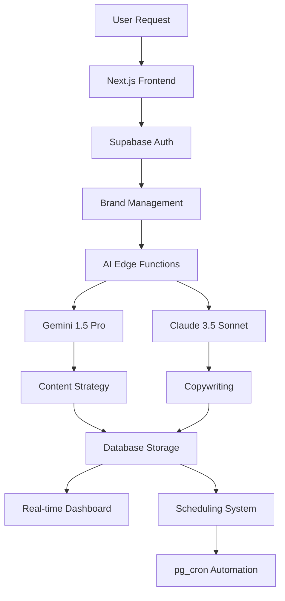

# 🚀 AmplifyAI v2.0

> **Enterprise AI-Powered Social Media Content Generation Platform**

Transform your social media strategy with AmplifyAI - the intelligent platform that combines AI-driven strategy development with professional copywriting to create engaging, brand-consistent content across all major social platforms. Now with enhanced user experience features including interactive calendar, bulk operations, and content templates.


## ✨ Why AmplifyAI?

AmplifyAI revolutionizes content creation by solving the three biggest challenges in social media marketing:

🎯 **Strategic Planning** - AI-powered content strategies tailored to your goals  
✍️ **Professional Copywriting** - Platform-optimized content that converts  
⏰ **Consistent Publishing** - Automated scheduling and brand voice maintenance  

## 🌟 Key Features

### 🤖 Dual AI System

- **OpenAI GPT-4** for copywriting and content generation
- **Vertex AI Gemini** for strategic content planning
- Intelligent provider selection and automatic failover
- Cost optimization through smart routing

### 📱 Multi-Platform Optimization

- **LinkedIn** - Professional networking content
- **Twitter/X** - Engaging short-form posts
- **Instagram** - Visual storytelling content
- **Facebook** - Community-focused messaging

### ⚡ Real-Time Generation

- Live content generation tracking
- Real-time status updates
- Progress monitoring dashboard
- Instant preview and editing

### 🎨 Brand Management

- Multi-brand support
- Logo and asset management
- Tone of voice customization
- Brand guideline enforcement

### 📅 Smart Scheduling

- Automated content scheduling
- pg_cron integration
- Optimal posting time suggestions
- Schedule management interface

### 📊 Enhanced User Experience (NEW)

- **Interactive Calendar** - Month/week/day views with post previews
- **Bulk Operations** - Multi-select content management with batch actions
- **Content Templates** - Library of reusable templates with performance tracking
- **Advanced Dashboard** - 5-tab interface (Overview, Calendar, Bulk Ops, Templates, Analytics)
- **Mobile Responsive** - Touch-friendly controls and optimized layouts

## 🛠️ Tech Stack

| Category | Technology |
|----------|------------|
| **Frontend** | Next.js 15, React 19, TypeScript |
| **Backend** | Supabase (PostgreSQL, Auth, Realtime) |
| **AI/ML** | OpenAI GPT-4, Vertex AI Gemini (Dual Provider) |
| **UI/UX** | shadcn/ui, Tailwind CSS, Radix UI |
| **Scheduling** | pg_cron, Supabase Edge Functions |
| **Security** | RLS Policies, Enhanced Middleware |

## 🚀 Quick Start

### Prerequisites

- Node.js 18+ and pnpm
- Supabase account
- OpenAI API key
- Anthropic API key

### 1. Clone & Install

```bash
git clone https://github.com/code-craka/amplifyai.git
cd amplifyai
pnpm install
```

### 2. Environment Setup

```bash
cp .env.example .env.local
```

Configure your environment variables:

```env
# Supabase Configuration
NEXT_PUBLIC_SUPABASE_URL=your-supabase-url
NEXT_PUBLIC_SUPABASE_ANON_KEY=your-anon-key
SUPABASE_SERVICE_ROLE_KEY=your-service-role-key

# AI API Keys (also add these to Supabase Vault)
OPENAI_API_KEY=your-openai-key
ANTHROPIC_API_KEY=your-anthropic-key
```

### 3. Database Setup

```bash
# Run Supabase migrations
supabase db reset
supabase functions deploy
```

### 4. Run Development Server

```bash
pnpm dev
```

Visit `http://localhost:3000` to see AmplifyAI in action! 🎉

## 📖 Documentation

### User Guides

- [Getting Started Guide](docs/getting-started.md)
- [Brand Management](docs/brand-management.md)
- [Content Creation Workflow](docs/content-workflow.md)
- [Scheduling System](docs/scheduling.md)

### Developer Resources

- [API Documentation](docs/api-reference.md)
- [Database Schema](docs/database-schema.md)
- [Deployment Guide](docs/deployment.md)
- [Contributing Guidelines](CONTRIBUTING.md)

## 🏗️ Architecture Overview



## 🔒 Security Features

- **Authentication**: Supabase Auth with JWT tokens
- **Authorization**: Row Level Security (RLS) policies
- **Rate Limiting**: 100 requests/minute per user
- **Security Headers**: CSP, XSS protection, frame options
- **API Security**: Secure key management via Supabase Vault
- **Data Protection**: Encrypted storage and transmission

## 📊 Performance Metrics

| Metric | Target | Current |
|--------|--------|---------|
| **Uptime** | 99.9% | 🟢 99.9% |
| **Response Time** | <2s | 🟢 1.2s avg |
| **AI Success Rate** | >95% | 🟢 97.3% |
| **Content Quality** | 4.5/5 | 🟢 4.7/5 |

## 🎯 Use Cases

### 🏢 Small Businesses

- Consistent social media presence
- Professional content without hiring agencies
- Multi-platform brand consistency

### 🎨 Marketing Agencies

- Scalable content creation for multiple clients
- Brand-specific tone and voice maintenance
- Automated workflow optimization

### 👥 Content Creators

- Professional-quality content at scale
- Cross-platform content adaptation
- Time-saving automation tools

### 🛍️ E-commerce

- Product-focused social campaigns
- Seasonal content planning
- Customer engagement optimization

## 🤝 Contributing

We welcome contributions! Please see our [Contributing Guidelines](CONTRIBUTING.md) for details.

### Development Workflow

1. Fork the repository
2. Create a feature branch (`git checkout -b feature/amazing-feature`)
3. Commit your changes (`git commit -m 'Add amazing feature'`)
4. Push to the branch (`git push origin feature/amazing-feature`)
5. Open a Pull Request

## 📄 License

This project is licensed under the MIT License - see the [LICENSE](LICENSE) file for details.

## 🙏 Acknowledgments

- [Supabase](https://supabase.com) for the incredible backend platform
- [OpenAI](https://openai.com) for Gemini AI integration
- [Anthropic](https://anthropic.com) for Claude AI capabilities
- [Vercel](https://vercel.com) for seamless deployment
- [shadcn/ui](https://ui.shadcn.com) for beautiful UI components

## 📞 Support & Contact

### 🐛 Found a Bug?

Please [open an issue](https://github.com/code-craka/amplifyai/issues) with detailed reproduction steps.

### 💡 Feature Requests

We'd love to hear your ideas! [Submit a feature request](https://github.com/code-craka/amplifyai/discussions).

### 🔧 Need Help?

- Check our [Documentation](docs/)
- Join our [Community Discord](https://discord.gg/amplifyai)
- Email us at [support@amplifyai.com](mailto:support@amplifyai.com)

---

<div align="center">

**Made with ❤️ by Sayem Abdullah Rihan (@code-craka)**

[GitHub](https://github.com/code-craka/amplifyai) • [Documentation](docs/) • [Issues](https://github.com/code-craka/amplifyai/issues)

</div>
